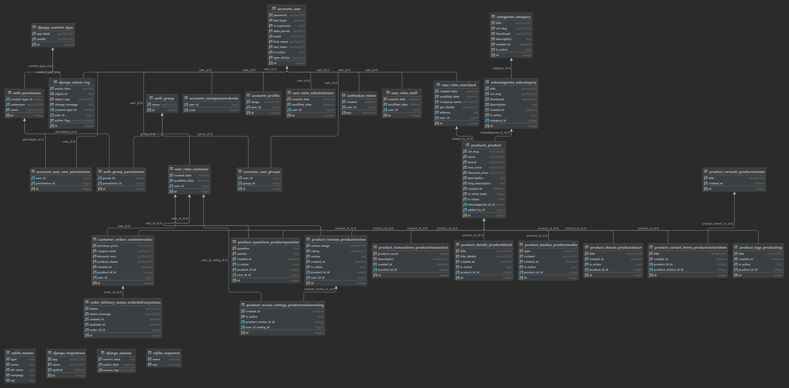
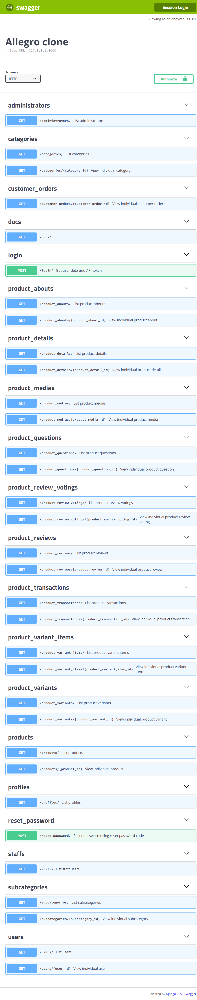

# Overview

Allegro-clone is a demo clone of a popular e-commerce website.

This is a backend of the clone, actually REST API.

# Table of contents

* [Project setup](#project-setup)
* [Dependencies](#dependencies)
* [Entity diagram](#entity-diagram)
* [API documentation](#api-documentation)

# Project setup

Clone the repository (in your terminal):

```
git clone https://github.com/emge1/allegro-clone-api.git
```

Create virtual environment and activate it in IDE (recommended IDE: PyCharm):

```
cd allegro-clone-api
python -m venv venv
venv\Scripts\activate.bat
```

install the required packages:

```
pip install -r requirements/local.txt
```

initialize database:

```
python manage.py makemigrations
python manage.py migrate
```

and run:
```
python manage.py runserver
```

# Dependencies
* Django Rest Framework
* Django
* Pytest Django
* Django Rest Swagger (to create docs)
* Django Cors Header (to make connecting with frontend possible)
* SQLite (local)
* Postgres (production)

# Entity diagram 
Click on the picture for bigger view.



# API documentation

To view API documentation, run development server and visit http://127.0.0.1:8000/docs/

Here is a docs screenshot created with Swagger, for non-authenticated user.

If you can see a screenshot with all possible HTTP methods to all the objects, click [here](media/127.0.0.1_8000_docs_.png)

